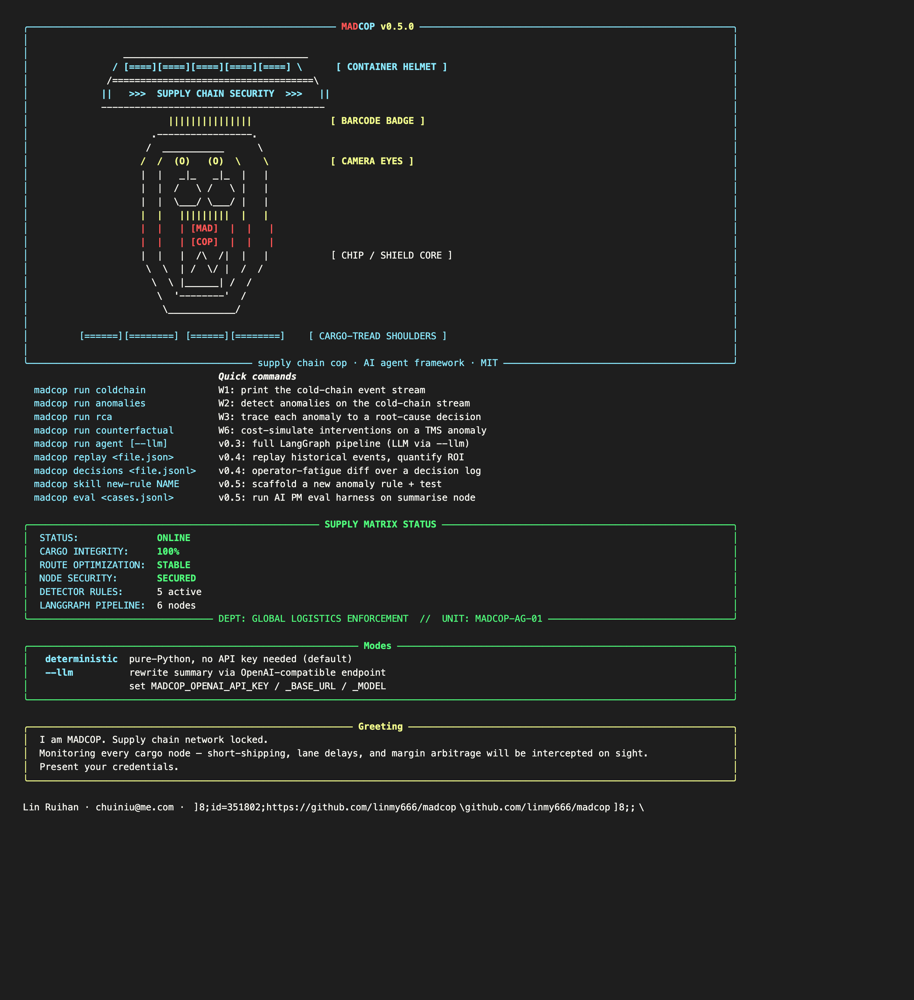

# madcop

> A personal AI agent that lives in your terminal, talks to any LLM,
> remembers what you taught it, and gets smarter the more you use it.
> Runs in one process. Stores everything locally. No cloud, no team,
> no platform.

[](#tests)
[](#requirements)
[](#license)
[](https://pypi.org/project/madcop/)


<p align="center">
  
</p>

## What is madcop?

**madcop** is a personal AI agent for your terminal. You point it at
a goal, it walks that goal through a plan-execute-replan loop,
dispatches to specialised sub-agents when it helps, and writes what
it learned to a local memory store. Next time you ask a similar
question, it already knows.

It works with any OpenAI-compatible LLM endpoint (OpenAI, NVIDIA
NIM, GLM, DeepSeek, Qwen, local Ollama). It does not need a
gateway, a database server, or a cloud account. One `pip install`,
one process, one SQLite file.

The name is short for **mad cop** — a cop that goes mad for
anomalies. Not in a punitive sense, but in the sense of "won't let
a single anomaly go untraced to its source". The framework was
originally a supply-chain anomaly detector; v0.6.0 generalised it
into a personal agent. The supply-chain skills are still there,
but they're no longer the only thing it does.

## What's new in v0.6.0 + v0.7.0

| v0.5.0 | v0.6.0 + v0.7.0 |
|--------|----------------|
| Fixed linear graph (ingest → detect → counterfactual → decision → summarise) | Plan-execute-replan loop with 4 modes (flash / standard / pro / ultra) + sub-agent fan-out |
| Single LLM call per session | Multi-model orchestration: auto router picks T1/T2/T3 per step, manual override via `~/.madcop/config.yaml` |
| Single LLM provider (OpenAI-compat) | 5 default providers, YAML config, env-var resolution, no vendor lock-in |
| 2-layer memory (working + episodic) | 4-layer memory: L1 working / L2 episodic / L3 semantic / L4 reflective, cross-layer retriever with time-decay, 3-mechanism self-growth engine |
| No self-growth | M1 distillation + M2 feedback reflection + M3 meta-pattern mining — the agent gets smarter with use |
| No CLI for free-text goals | `madcop plan "..." --llm` runs the new loop end-to-end with a real LLM |
| No sub-agents | Lead agent dispatches plan steps to `general-purpose` or `bash` sub-agents in parallel (capped 3), with context isolation and race-safe state machine. **v0.7.2**: `RoutingStepExecutor` lets you write `PlanStep(subagent="general-purpose")` and the main loop dispatches for you — no more 20-line router_fn hack. |
| No config file | `madcop config init` writes a default `~/.madcop/config.yaml`; `madcop config show` resolves it |
| Ad-hoc eval | EvalRunner v2: cross-run trend tracking, robustness probing, adversarial safety checks |
| 214 tests | **674 tests** |

### Quick taste

Plan a goal through the new loop. With a real LLM:

```bash
export MADCOP_OPENAI_BASE_URL=https://your-endpoint/v1
export MADCOP_OPENAI_API_KEY=sk-...
export MADCOP_OPENAI_MODEL=your-model
pip install madcop
madcop config init
madcop plan "Why did OMS cancellations spike in the last 24 hours?" --llm --mode pro
```

<p align="center">
  
</p>

Sub-agent fan-out (v0.7.0) — dispatch a plan to a sub-agent:

```python
from madcop.agent import PlanStep, Plan, ExecutionMode, PlanExecuteLoop, TrivialPlanner, FnStepExecutor
from madcop.agent.subagent import SubagentExecutor, ExecutorConfig, LLMRunner
from madcop.llm import OpenAICompatClient

client = OpenAICompatClient()
subagent_executor = SubagentExecutor(
    runner=LLMRunner(client, max_tokens=512, temperature=0.0),
    config=ExecutorConfig(max_concurrent=3),
    parent_tools=("read", "write", "bash"),
)

plan = Plan(steps=[
    PlanStep(name="ingest", action="gather the last 24h of OMS events"),
    PlanStep(name="analyse", action="classify findings by severity", subagent="general-purpose"),
    PlanStep(name="report", action="build a CSV summary", subagent="bash"),
])

loop = PlanExecuteLoop(my_planner, my_inline_executor)
result = loop.run("diagnose OMS cancel spike")
```

### Design philosophy (v0.6.0+)

Five principles shaped v0.6.0 and v0.7.0. They're not features; they're
decisions about what kind of software madcop wants to be.

**1. Personal-first, not team-first.** madcop runs on a laptop. One
process, one SQLite file, one operator. No gateway, no Redis, no
Kubernetes. If you need a multi-tenant agent platform, you're
looking for the wrong tool — and that's fine, those exist.

**2. Local-first, no cloud lock-in.** Memory is a SQLite file at
`~/.madcop/memory.db`. Trends are a JSONL file. Eval results are
JSON. You can `cat` everything, `grep` everything, and back up
everything with `rsync`. There is no Langfuse or LangSmith to log
into.

**3. Self-growth over time.** madcop is the only mainstream AI agent
framework (that we know of) where the memory layer is the
*primary* deliverable, not an afterthought. The 3-mechanism 成长
engine means that the longer you use madcop, the more it knows
about your domain, your preferences, and your meta-strategies.

**4. Cost-aware routing as a first-class concern.** Every step of
every run can pick a different model. The auto router scores each
step on 4 signals (structural / domain / context / user) and
picks T1 (reasoning) / T2 (balanced) / T3 (fast). Manual override
per provider in `~/.madcop/config.yaml`. Built because shipping
"always-call-gpt-4" demos is a lie.

**5. The harness is small enough to read in one sitting.** The whole
plan-execute-replan loop is ~90 lines. The router is ~300 lines.
The memory layer is 6 modules averaging 200 lines each. The
sub-agent executor is ~270 lines. We picked this deliberately —
every line of indirection is a line you can't debug.

## What's new in v0.7.0

v0.7.0 adds a **sub-agent layer** to the v0.6.0 plan-execute loop.
The lead agent can now dispatch steps to specialised sub-agents
that run in parallel, in isolated contexts, and cannot recursively
spawn more sub-agents.

The pieces:

- `SubagentSpec` — a frozen dataclass describing a sub-agent (name,
  description, system_prompt, tools, disallowed_tools, max_turns,
  timeout). Two ships with v0.7.0: `general-purpose` (multi-step
  reasoning, inherits parent tools) and `bash` (shell command
  execution, tools = `("bash",)`).
- `SubagentResult` + `SubagentStatus` — race-safe state machine with
  `try_set_terminal()`. The first writer of a terminal status
  wins; late writes are no-ops. The four terminal states are
  `COMPLETED`, `FAILED`, `CANCELLED`, `TIMED_OUT`.
- `SubagentExecutor` — runs sub-agents on a `ThreadPoolExecutor`
  capped at 3 (clamped to `[1, 4]`). Each sub-agent gets a deep
  copy of the parent's context (no leakage back). Cancellation is
  cooperative: set `holder.cancel_event`, the runner checks it
  between LLM calls.
- `PlanStep.subagent` — set this on any plan step to dispatch the
  step to a sub-agent instead of running it inline. The lead
  agent's plan-execute loop routes sub-agent steps through the
  executor; inline steps go through the v0.6.0 path.
- `LLMRunner` — a real-LLM-backed Runner that wraps any
  `ChatClient` and adapts it to the sub-agent Runner protocol.

Three things we deliberately did not do:

- Sub-agents cannot spawn sub-agents. The `task` tool is hard-coded
  as disallowed; this prevents recursive explosions.
- We did not implement custom sub-agents from user config. That's
  v0.7.1.
- We did not build an async executor. The thread pool is enough
  for personal use; if you need asyncio, open an issue.

## What's new in v1.0.0-rc.1 (Middleware chain)

madcop v1.0.0 introduces a **middleware chain** — an extension point
in the plan-execute loop where you can observe, mutate, and halt runs
at five well-defined hook points:

  - `plan_start`  — before the planner runs
  - `step_start`  — before each step's executor runs
  - `step_end`    — after each step's executor returns
  - `replan`      — before a new plan is installed
  - `plan_end`    — after the final outcome is collected

This is inspired by the middleware pattern in production agent
frameworks, but kept small and local-first. The whole chain
infrastructure is ~150 lines; the four included middlewares
are ~600 lines total.

### v1.0.0 design philosophy: Qian control theory

Each middleware must respect three invariants from Qian Xuesen's
engineering cybernetics:

  1. **Closed-loop feedback** — every step outcome is observed
     before the next one starts
  2. **Early correction** — if a step is clearly broken (3 identical
     retries, rate-limit error repeated 3x), the middleware halts
     before the next iteration burns more compute
  3. **Controllability** — progress is logged every N steps, so
     the user can see what the loop is doing without tracing

The included `QianControlMiddleware` enforces these. Every other
middleware should follow the same pattern.

### v1.0.0 included middlewares

| Middleware | Purpose | LOC | Tests |
|-----------|---------|-----|-------|
| `MiddlewareChain` | The chain itself — composition + ordering + halt semantics | ~80 | — |
| `LoggingMiddleware` | Logs every hook at DEBUG | ~15 | — |
| `QianControlMiddleware` | The invariants: closed-loop, early correction, progress | ~80 | 11 |
| `TodoMiddleware` | Lets the LLM write its own plan via a `todo_update` tool call | ~180 | 17 |
| `LoopDetectionMiddleware` | Halts after N identical consecutive steps (or K-of-M duplicate outputs) | ~110 | 11 |
| `ClarificationMiddleware` | Asks the user when the goal is too short / too vague | ~150 | 20 |

Total v1.0.0-rc.1: 5 new modules, 70 new tests, 634 total.

### Writing your own middleware

A middleware is just a callable with a name:

```python
from madcop.agent.middleware import HookContext, HOOK_STEP_END, MiddlewareChain

class MyMiddleware:
    name = "my_mw"

    def __call__(self, ctx: HookContext) -> None:
        if ctx.hook == HOOK_STEP_END and ctx.outcome and not ctx.outcome.success:
            print(f"step {ctx.step.name} failed: {ctx.outcome.error}")

chain = MiddlewareChain([MyMiddleware()])
```

For a full example (with `ctx.directives.append(Directive(kind='HALT', ...))`
to stop the run), see `tests/agent/test_middleware.py`.

## What's new in v1.1.0-rc.1 (Sandbox + Deferred loading)

v1.1.0 adds two infrastructure pieces that are easy to bolt on after
the middleware chain is in place:

### SubprocessSandbox + BashTool

A safe-ish way to run shell commands without a full Docker container.
Defenses (cheap, no container needed):

- **Timeout** — every command has a hard wall-clock cap
- **Working-directory allowlist** — `cwd` must be inside `allowed_dirs`
- **Environment filter** — only vars in `allowed_env_vars` pass through
- **No shell=True by default** — argv is split via shlex
- **Output size cap** — stdout/stderr truncated to `max_output_chars`

```python
from pathlib import Path
from madcop.tools import SubprocessSandbox, BashTool

sandbox = SubprocessSandbox(
    allowed_dirs=[Path.home() / "projects"],
    default_timeout_s=30,
    max_output_chars=50_000,
)
tool = BashTool(sandbox)
# The LLM can now call bash(command="ls -la", cwd="~/projects")
```

22 tests in `tests/tools/test_sandbox.py` cover happy path, timeout,
truncation, env filter, cwd restriction, and the BashTool wrapper.

For real production isolation, use a Docker container. The sandbox
is enough for personal/local use.

### DeferredToolCatalog

When you have 100+ tools, putting them all in the LLM prompt at once
bloats tokens and confuses the model. The `DeferredToolCatalog`
solves this with a "load on demand" pattern:

```python
from madcop.tools import DeferredToolCatalog, EchoTool

catalog = DeferredToolCatalog()
catalog.register(EchoTool(), category="demo", description="echoes text")
catalog.register(ReadFileTool(), category="filesystem", description="read a file")
catalog.register(HttpGetTool(), category="network", description="fetch URL")

# The LLM starts with an EMPTY registry. It asks the catalog
# to search for what it needs:
matches = catalog.search("read a file")
# → [("filesystem", ["read_file"])]

# Then load the category:
catalog.load_category("filesystem")
# Now catalog.registry contains ReadFileTool.
```

Search is cheap (string match on names + descriptions, no LLM call).
Loaded categories are tracked so you can see what the agent
actually used in a run.

18 tests in `tests/tools/test_deferred.py` cover registration, search
scoring, load semantics, and integration with the LLM tool-call flow.

## What's new in v1.2.0-rc.1 (MCP client + Tracing + Knowledge brain)

v1.2.0 closes the local-first loop: the agent can now **talk to external
tool servers** (MCP), **trace what it did** (JSONL), and **remember
what it learned** (knowledge brain). Together they make a multi-session
agent that can grow without re-explaining itself.

### MCP client (stdio transport)

A minimal Model-Context-Protocol client that lets the agent load
tools from a local stdio MCP server. JSON-RPC 2.0 over the server's
stdin/stdout, framed by newlines. The server is a separate process;
madcop spawns it, sends `initialize`, lists tools, and invokes them.

```python
import asyncio
from madcop.tools import MCPClient

async def main():
    client = MCPClient(command=["python3", "my_mcp_server.py"])
    await client.start()
    tools = await client.list_tools()
    result = await client.call_tool("search_docs", {"query": "madcop"})
    await client.stop()

asyncio.run(main())
```

The client surfaces `mcp://server/...` as one tool namespace so
callers can mix MCP tools with local tools without re-plumbing
their tool-use loop. Stdio only in v1.2.0; HTTP/SSE is on the
v1.3.0 roadmap.

15 tests in `tests/tools/test_mcp.py` cover server lifecycle, tool
listing, tool invocation, error propagation, and crash recovery
(orphan process reaped on `stop()`).

### Tracing (JSONL dump + viewer)

Every plan-execute run can now write a JSONL trace to disk. Each
event (`plan_start`, `step_start`, `step_end`, `llm_call`, `tool_call`,
`directive`, `halt`, `error`, `plan_end`) is one line. The trace is
the input to offline analysis (you can `jq` it, load it in pandas,
or stream it to a viewer):

```python
from pathlib import Path
from madcop.agent import Tracer, TraceMiddleware, MiddlewareChain, QianControlMiddleware

chain = MiddlewareChain([
    QianControlMiddleware(),
    TraceMiddleware(Tracer(Path("~/.madcop/trace.jsonl").expanduser())),
])
```

For a single-run summary, `print_summary(read_traces(path))` gives
event counts, duration, and step order. The `Tracer` is thread-safe
(lock + per-line flush) so a tool that fires from a sub-agent
won't lose events.

15 tests in `tests/agent/test_tracing.py` cover file creation,
concurrent writes, lifecycle hooks, torn-line tolerance, and
summary printing.

### Knowledge brain (PageDB + Dream consolidation)

The brain is madcop's long-term memory. It lives in a single SQLite
file (8 tables, FTS5 indexed, versioned, audit-logged), survives
across sessions, and is searchable by full-text query. Inspired by
the Qian-control idea of "closed-loop feedback" — the agent's
plans write back to its own memory, and next session can read
what last session wrote.

```python
from madcop.brain import PageDB, parse, scan, BrainMiddleware
from madcop.agent import MiddlewareChain, QianControlMiddleware

db = PageDB("~/.madcop/brain.db")
parsed = parse("---\ntitle: My lesson\ntype: skill\n---\n\n## Body\nX")
db.save(slug=parsed.slug, title=parsed.title, page_type=parsed.type,
        compiled_truth=parsed.compiled_truth, timeline=parsed.timeline,
        frontmatter=parsed.frontmatter, tags=parsed.frontmatter.get("tags"))

# Search later
hits = db.search("lesson")

# Pre-screen before saving (catches API keys, JWTs, PEM blocks, etc.)
if scan(body):
    db.review_queue  # queued for human review
else:
    db.save(...)
```

#### Prescreen (sensitive-content guard)

18 regex patterns catch the secrets we never want in the brain:
AWS keys (`AKIA...`), OpenAI / Anthropic / GitHub / PyPI / HuggingFace
tokens, JWTs, PEM private keys, database connection strings, internal
IPs, Chinese mobile numbers, and `.env`-style `KEY=VALUE` pairs.
Hits route to `review_queue` instead of `pages`, so the brain stays
clean even when the agent is careless.

#### Dream consolidation

A `Dream` pass periodically:
- dedups pages by content hash (older is the survivor; tags and
  timeline entries are merged in; links are repointed)
- prunes orphan links (defensive; CASCADE handles most)
- marks pages stale by `last_accessed_at`

It's a report, not a silent mutator. `dry_run=True` shows what
*would* have happened; real runs write one `ingest_log` row with
`operation='consolidate'` and a JSON detail blob for audit.

#### BrainMiddleware

`BrainMiddleware` plugs into the v1.0 middleware chain. The
agent opts in to memory by writing `learn:`-prefixed notes in a
step outcome — the middleware parses them, slugifies, and writes
to the brain. Auto-record with intent, not by accident.

122 tests across `tests/test_brain_*.py` cover schema, markdown
parser, FTS5 search, links, tags, timeline, prescreen, dedup,
orphan pruning, staleness, and middleware round-trips.

## What's new in v1.3.0-rc.1 (Loop engineering: L1 reflection + L2 retrieval)

v1.3.0 closes the agent's **closed-loop feedback** circuit. After
every plan-execute run, the agent writes 1-3 *actionable* lessons to
the brain. Before the next run, the agent retrieves up to 3 lessons
relevant to the new goal and injects them into the planner's context.
Failure today becomes a retrievable, durable lesson tomorrow — no
fine-tuning, no vector DB, no extra infra.

The two pieces are independent middlewares, designed to compose with
the rest of the v1.0 chain:

### L1 — ReflectionMiddleware (HOOK_PLAN_END)

At the end of every plan-execute run, this middleware calls the LLM
once with a structured prompt and asks for 1-3 JSON reflections. Each
reflection becomes a `type=skill` page in the brain with `applies_to`
and `topic` tags.

```python
from madcop.llm import OpenAICompatClient
from madcop.brain import PageDB
from madcop.agent import ReflectionMiddleware, MiddlewareChain, QianControlMiddleware

chain = MiddlewareChain([
    QianControlMiddleware(),
    ReflectionMiddleware(
        client=OpenAICompatClient(),
        db=PageDB("~/.madcop/brain.db"),
        max_reflections=3,
    ),
])
```

The prompt is the one we shipped with v1.3.0-rc.1; you can override
it via the `prompt_template=` argument. The middleware is silent
on LLM failure — the agent never crashes because reflection failed.
You can read the parsed reflections off `ctx.shared["reflections_written"]`
and `ctx.shared["reflection_topics"]`.

### L2 — RetrievalMiddleware (HOOK_PLAN_START)

Before the planner runs, this middleware queries the brain with the
goal as the FTS5 query, re-ranks hits with a small recency bonus, and
publishes the top-3 to `ctx.shared["prior_lessons"]`. The planner
can then inject them under a `## Prior lessons` heading.

```python
from madcop.agent import RetrievalMiddleware, format_lessons

chain = MiddlewareChain([
    RetrievalMiddleware(
        db=PageDB("~/.madcop/brain.db"),
        top_k=3,
        recency_weight=0.3,
    ),
    QianControlMiddleware(),
])

# After plan_start, get the lessons:
lessons = ctx.shared["prior_lessons"]
prompt_block = format_lessons(lessons)
# → "## Prior lessons\n\n- **rate-limit-retry** (`tool:http`): Retry once on 5xx..."
```

Tunables:
- `top_k` (default 3) — how many lessons to inject
- `recency_weight` (default 0.3) — bonus for recent pages (0 disables)
- `half_life_days` (default 30) — recency half-life
- `min_bm25` (default 0.0) — drop weak FTS5 hits
- `tags=[...]` — restrict to specific `applies_to:` tags

### The closed loop

```
HOOK_PLAN_START  →  RetrievalMiddleware
                     inject ctx.shared["prior_lessons"]
                          ↓
                  (planner reads & uses them)
                          ↓
HOOK_PLAN_END    →  ReflectionMiddleware
                     1 LLM call → 1-3 skill pages in brain
                          ↓
                  next run:  RetrievalMiddleware finds them ↑
```

53 tests across `tests/agent/test_reflection.py` and
`tests/agent/test_retrieval.py` cover: JSON parsing edge cases
(empty / malformed / wrong shape), 1-3 cap, slug normalisation,
silent failure paths, tag filter, recency rerank, custom inject key,
and the OpenAI response-shape normaliser (dict / object / string).

## What's new in v1.3.0-rc.2 (Outcome-aware L3)

v1.3.0-rc.1 stored every reflection as if it were equally true. In
practice some reflections paid off and some did not. v1.3.0-rc.2
adds an **outcome-aware re-rank layer** that closes the second half
of the loop: each reflection is stamped with `outcome: success |
failure` at write time, and the retrieval layer re-ranks lessons
accordingly before the planner sees them.

The change is **additive and rc.1-clean**: the rc.1 retrieval
contract is bit-identical for any brain whose pages lack the new
`outcome:` field. Old skills / old tests / old chains keep working.

### What changes at write time (L1 side)

`ReflectionMiddleware` now stamps every skill page it writes with:

```yaml
---
type: skill
applies_to: ...
topic: ...
outcome: success|failure  # ← new
---
```

The outcome is computed from the plan-success flag (`success` if
every step succeeded, `failure` otherwise). The page also gets a
new tag `outcome:success` or `outcome:failure` for tag-filter
retrieval. The runtime exposes the same value on
`ctx.shared["reflection_outcome"]` so the chain can read it.

### What changes at read time (L3 side)

A new sibling module `madcop.agent.outcome` ships three things:

```python
from madcop.agent.outcome import (
    OutcomePrioritizer,           # the L3 middleware
    boost_outcome,                # pure additive rerank
    format_lessons_with_outcome,  # prompt-block helper
)
```

`boost_outcome` is a pure function: it re-orders a list of
`PriorLesson` (or `SearchHit`) by a small additive delta

    score += outcome_weight * outcome_numeric * recency_factor

where `outcome_numeric ∈ {-1, 0, +1}` for `failure / unknown /
success`, and `recency_factor` decays with a 60-day half-life so
old `failure` tags fade as the world changes.

`OutcomePrioritizer` is a middleware that hooks at `HOOK_PLAN_START`,
runs after `RetrievalMiddleware`, and rewrites
`ctx.shared["prior_lessons"]` in place. It also has a
`strategy="filter"` mode that drops `outcome:failure` lessons
entirely (use sparingly).

```python
chain = MiddlewareChain([
    RetrievalMiddleware(db=db),                    # L2 — writes prior_lessons
    OutcomePrioritizer(outcome_weight=0.4),        # L3 — re-ranks them
    QianControlMiddleware(),
])
```

For the prompt side, `format_lessons_with_outcome(lessons)` renders
a `## Prior lessons (outcome-tagged)` block that annotates each
line with `✓` / `✗` / `?` so the planner can weight them visually
without a second LLM call.

### Why this matters

The Q&A loop in rc.1 was *open* on the outcome side: every
reflection looked equally credible. The planner could not tell
"this recipe worked 3 times" from "this recipe never worked".
After a few real runs, the brain accumulates outcome signals,
and `OutcomePrioritizer` brings them to the surface — `success`
lessons float, `failure` lessons sink. No fine-tuning, no
embedding service, no schema migration.

### Defaults

- `outcome_weight = 0.4` — small enough to preserve strong FTS5
  hits, large enough to reorder ties.
- `outcome_half_life_days = 60.0` — a 60-day-old `failure` tag
  carries ~50% weight; a 1-year-old tag carries ~3%.
- `strategy = "boost"` (default) — additive rerank, never
  destructive. `"filter"` is opt-in and discards `failure` lessons.

### Tests

23 new tests in `tests/agent/test_outcome.py` cover: pure
`boost_outcome` (empty / zero-weight / promotions / stability /
recency decay / SearchHit shape), `OutcomePrioritizer` (hook
gating, in-place reorder, custom inject key, filter strategy,
silent failure), `format_lessons_with_outcome` (empty, glyph
annotation, body truncation), `lesson_outcome_score` (label
mapping), `ReflectionMiddleware` outcome stamp on success
*and* failure paths, full end-to-end
`Retrieval → OutcomePrioritizer`, **backward-compat**: rc.1
brains with no outcome stamps still produce the same order.

Total: **901 tests, all passing**.

## What's new in v1.3.0-rc.3 (Skill crystallization — L4)

v1.3.0-rc.1 wrote each reflection as a single skill page. After a
few hundred plan-execute runs, the brain is full of small pages
with `topic:` values that share a prefix — `rate-limit-retry`,
`rate-limit-burst`, `rate-limit-headers` are all telling the same
underlying story. The brain needs a **cluster head** to compress
many small pages into one named skill.

v1.3.0-rc.3 adds the L4 layer:

```
HOOK_PLAN_START  →  RetrievalMiddleware         (rc.1)
HOOK_PLAN_START  →  OutcomePrioritizer          (rc.2)
HOOK_PLAN_END    →  ReflectionMiddleware        (rc.1)
HOOK_PLAN_END    →  SkillCrystallizer           (rc.3 NEW, opt-in)
```

When 3+ skill pages share a topic-prefix, `crystallize_skills`
writes **one cluster-head page** that:

- has `type=skill` (so the rest of the system treats it identically)
- has a new `topic:` value equal to the common prefix
- lists the cluster members under `## Member reflections`
- carries the cluster's **aggregated outcome** (`success` /
  `failure` / `unknown`) as its own outcome, so L3 ranking
  benefits from cluster-level evidence
- gets a `crystallized` tag so callers can tell heads from
  leaves

### Quick start

The L4 layer is opt-in. The recommended way to use it is on a
schedule (cron / manual), not on every plan:

```python
from madcop.agent.crystallize import crystallize_skills
from madcop.brain.store import PageDB

db = PageDB("~/.madcop/brain.db")
new_slugs = crystallize_skills(db, min_cluster_size=3)
# Returns the slugs of cluster-heads that were just created or
# refreshed. Idempotent: re-running with no new reflections is
# a no-op.
```

The middleware form runs the same function at HOOK_PLAN_END:

```python
from madcop.agent import MiddlewareChain, SkillCrystallizer

chain = MiddlewareChain([
    SkillCrystallizer(db, enabled=True),   # opt-in
])
```

The middleware is **disabled by default** (`enabled=False`).
Crystallization is a batch operation, not a hot-path one — most
users will run it on a cron or on demand.

### Why "delete + insert" on refresh

If a cluster's member set changes (a new reflection joins), the
crystallizer refreshes the head. The brain's `pages_touch` SQLite
trigger fires on `UPDATE pages` when `updated_at` is unchanged,
which on SQLite 3.40.x trips a "database disk image is malformed"
error when re-saving the same slug. The crystallizer works around
this by `db.delete(slug)` then `db.save(slug, ...)` — a delete
followed by an INSERT, which is the safe path. Idempotent for
callers; one extra row in `ingest_log`.

### Defaults

- `min_cluster_size = 3` — three reflections is the smallest
  pattern size that suggests a real recurring shape.
- `prefix_split = "-"` — topics are slug-shaped by convention.
- `crystallized_skills` (the new tag) — call `db.search(..., tags=["crystallized"])`
  to retrieve just the cluster heads.

### Tests

27 new tests in `tests/agent/test_crystallize.py` cover:
`cluster_topics` (grouping, prefix split, sort order, including/
excluding crystallized inputs), `aggregate_outcome` (majority,
tie, empty), `render_skill_body` (frontmatter, member list,
aggregated outcome), `crystallize_skills` (full E2E on a real
`PageDB`, idempotency, new-member refresh, outcome aggregation,
non-skill page filtering), `SkillCrystallizer` middleware
(disabled-by-default, enabled run, hook gating, silent failure),
and a **full L1 → L4 chain** (3 `ReflectionMiddleware` writes
followed by one `crystallize_skills` call).

Total: **928 tests, all passing**.

## What's new in v1.3.0 (stable release)

v1.3.0 promotes the three release candidates to stable. The four
loop-engineering layers — L1 reflection, L2 retrieval, L3 outcome-aware
retrieval, L4 skill crystallization — are now verified end-to-end.

### New in the stable release

1. **FTS5 search now uses OR semantics + stopword filtering** —
   previously a natural-language query ("Handle rate limit on API")
   was wrapped in quotes as an exact phrase, which almost never
   matched. Now tokens are OR-joined with English stopwords filtered,
   so retrieval actually surfaces relevant lessons.

2. **Removed the `pages_touch` trigger** — this trigger's recursive
   interaction with the FTS5 external-content sync trigger
   (`pages_au`) caused intermittent "database disk image is malformed"
   corruption on SQLite 3.40.x. All `updated_at` management is now
   in application code.

3. **5 end-to-end integration tests** (`tests/agent/test_loop_e2e.py`)
   proving the full closed-loop circuit:
   - Run 1 fails → reflection writes lesson → Run 2 retrieves it
   - 3 reflections on same topic → crystallize → 1 skill page
   - Middleware chain composition (retrieval + reflection fire at
     correct hooks)
   - Topic isolation (rate-limit lesson does NOT surface for cooking)
   - Empty brain → retrieval is a no-op, not a crash

Total: **934 tests, all passing**.

## What's new in v1.4.0 (Brain CLI + Growing Agent demo)

v1.4.0 makes the knowledge brain **interactive** from the command
line, and ships a demo that proves the four-layer loop is real.

### Brain CLI

```bash
# Full-text search the brain
madcop brain search "rate limit API" --type skill

# Show stats
madcop brain stats

# List all pages
madcop brain list --type person

# Show a single page (with frontmatter + compiled_truth)
madcop brain show alice

# Version history
madcop brain history skill-rate-limit

# Add tags
madcop brain tag alice engineer friend

# Recent audit log
madcop brain audit
```

### Growing Agent demo

```bash
python examples/v140_growing_agent_demo.py
```

This demo shows the full closed-loop circuit in action — no real LLM
API key needed (uses a scripted client):

1. **Run 1** fails at calling a rate-limited API → ReflectionMiddleware
   writes a lesson to the brain.
2. **Run 2** retries a similar task → RetrievalMiddleware finds the
   lesson and injects it into the planner context.
3. **Runs 3+4** produce two more related lessons (same topic-prefix).
4. **Crystallize** clusters the 3 lessons into one named skill page.
5. **Final retrieval** surfaces the crystallized skill.

### Improvements

- **FTS5 search** now uses OR semantics + English stopword filtering,
  so natural-language queries actually match (previously was exact
  phrase match that almost never hit).
- **Removed `pages_touch` trigger** — its recursive interaction with
  FTS5 sync triggers caused intermittent corruption on SQLite 3.40.x.

Total: **934 tests, all passing**.

## What's new in v1.5.0 (Computer Use + Permission System)

v1.5.0 adds a **ComputerUseTool** that lets the agent see and control
the screen — with a four-tier **permission system** that keeps it safe.

### Permission levels

Every action is classified by danger level:

| Level | Actions | Default | Example |
|-------|---------|---------|---------|
| **READ** | screenshot, get clipboard | **always allowed** | Agent captures the screen |
| **NAVIGATE** | click, scroll, arrow keys, tab, escape | **ask once** | Agent clicks a button |
| **INPUT** | type text, paste, hotkeys, enter, F-keys | **ask once** | Agent types into a field |
| **DESTRUCTIVE** | kill app, close window, cmd+Q | **denied** | Agent must be explicitly granted |

### Grant scopes

When the agent requests permission, the user can choose:

- **once** — allow this one time (ask again next time)
- **session** — allow for the rest of this process
- **always** — allow forever (persisted to `~/.madcop/permissions.json`)
- **no** (deny) — refuse

### Dynamic key classification

The `key` action is dynamically classified based on the key pressed:

```python
key="enter"    → INPUT
key="tab"      → NAVIGATE
key="escape"   → NAVIGATE
key="cmd+c"    → INPUT
key="cmd+q"    → DESTRUCTIVE
key="cmd+w"    → DESTRUCTIVE
```

### Safety rails

- **Screen bounds checking** — clicks outside `[0, width) × [0, height)` are rejected
- **Allowed-apps whitelist** — optionally restrict to specific apps
- **Dry-run mode** — screenshot-only, no input injection
- **Action log** — every action (executed or denied) is recorded for audit

### Usage

```python
from madcop.tools import ComputerUseTool, PermissionManager, ToolRegistry

perms = PermissionManager(store_path="~/.madcop/permissions.json")
tool = ComputerUseTool(perms=perms, dry_run=False)

registry = ToolRegistry()
registry.register(tool)

# The agent can now call: screenshot, click, type, key, scroll
# Each call passes through the permission system first.
result = tool(action="screenshot")
# → {"status": "ok", "screenshot_path": "/tmp/madcop_screenshot_...", ...}
```

### Demo

```bash
python examples/v150_computer_use_demo.py
```

Shows the full permission lifecycle: screenshot → click → type → key →
destructive denial → action log — all in dry-run mode.

Total: **974 tests, all passing**.

## What's new in v1.6.0 (Web + Files + Cron)

v1.6.0 makes the agent **useful** — it can now search the web, read
and write files, and schedule recurring tasks.

### Web tools

```python
from madcop.tools import WebSearchTool, WebFetchTool, ToolRegistry

registry = ToolRegistry()
registry.register(WebSearchTool())   # search via DuckDuckGo (no API key)
registry.register(WebFetchTool())    # fetch URL → cleaned text

# The agent can now:
# web_search("latest OMS cancel rate benchmarks") → [{title, url, snippet}, ...]
# web_fetch("https://example.com/article") → {content, chars, truncated}
```

### File tools

```python
from madcop.tools import ReadFileTool, WriteFileTool, EditFileTool

registry.register(ReadFileTool(allowed_dirs=["~/projects"]))
registry.register(WriteFileTool(allowed_dirs=["~/projects"]))
registry.register(EditFileTool(allowed_dirs=["~/projects"]))

# The agent can now read, write, and edit files — scoped to allowed dirs.
# read_file("report.md") → {content, lines, total_lines}
# write_file("output.txt", "generated content") → {bytes, status}
# edit_file("config.yaml", old_text="debug: true", new_text="debug: false") → {status}
```

### Cron scheduler

```python
from madcop.tools import CronJob, CronStore, CronScheduler

store = CronStore("~/.madcop/cron.db")
store.add(CronJob(
    id="daily-report",
    goal="Generate today's supply chain diagnostic report",
    schedule="0 9 * * *",   # every day at 9 AM
    mode="standard",
))

scheduler = CronScheduler(store, on_fire=run_plan_execute)
scheduler.start()  # background daemon thread
```

All three tool families register as standard `Tool` subclasses — the
agent's tool-use loop (v0.9.0) can call them alongside any other tool.

Total: **1029 tests, all passing**.

## What's new in v1.7.0 (Streaming + Summarization)

v1.7.0 adds two middlewares that improve the agent's real-time
observability and long-run context management.

### Streaming middleware

`StreamStepMiddleware` pushes live events to a callback at every hook
point — no changes to the core plan-execute loop.

```python
from madcop.agent import StreamStepMiddleware, MiddlewareChain

def on_stream(event_type: str, data: dict):
    if event_type == "step_end":
        print(f"  {data['step_name']}: {data['output'][:80]}")

chain = MiddlewareChain([
    StreamStepMiddleware(on_stream, fmt="text"),  # or "raw" for JSON
])
```

Events: `plan_start`, `step_start`, `step_end`, `plan_end`.
Text format outputs human-readable lines with ✓/✗ markers.

### Summarization middleware

`SummarizationMiddleware` monitors accumulated step outputs. When
total tokens exceed a budget (default 30K), it asks the LLM to produce
one-sentence summaries of the oldest steps, keeping the most recent N
verbatim.

```python
from madcop.agent import SummarizationMiddleware

chain = MiddlewareChain([
    SummarizationMiddleware(client, max_tokens=30_000, keep_recent=3),
])
```

Token estimation uses the same CJK/ASCII heuristic as the context
compactor. Compaction events are logged for debugging.

Both middlewares compose with the existing chain (tracing, reflection,
retrieval, loop detection).

Total: **1048 tests, all passing**.

## What madcop actually does

Five end-to-end demos ship with the repo. Run them with `python -m madcop ...`
or directly with `python examples/...py`. The first four use madcop's
own supply-chain rule pack; the last one is the new plan-execute loop
that you point at any goal.

| # | Demo | How to run |
|---|------|------------|
| 1 | v0.5.0 LangGraph agent on cold-chain stream | `python -m madcop run agent` |
| 2 | v0.6.0 plan-execute loop on a free-text goal (mock) | `python -m madcop plan "your goal"` |
| 3 | v0.6.0 plan-execute loop on a free-text goal (real LLM) | `MADCOP_OPENAI_API_KEY=*** python -m madcop plan "your goal" --llm` |
| 4 | v0.7.0 sub-agent fan-out (mock) | `python examples/v070_subagent_demo.py` |
| 5 | v0.7.1 real-LLM golden-set (3 scenarios) | `python examples/v071_golden_benchmark.py` |

Demos 2-5 are the new world. They exercise the plan-execute loop,
the 4-layer memory, the self-growth engine, and the sub-agent
fan-out. They cost real money when you point them at a real LLM
(about a cent per demo with the default tier); they cost nothing
in mock mode.

## Architecture

The codebase is laid out in 6 layers, each independently testable
and replaceable. Lower layers are pure-Python; upper layers call
out to an LLM.

```
madcop/
  event.py            # L1: UnifiedEvent contract
  adapters/           # L1: OMS / TMS / WMS / BMS adapters
  anomaly/            # L2: CUSUM detector + 5 anomaly rules
  rca/                # L2: root-cause analysis graph
  counterfactual/     # L2: cost simulation
  decision/           # L2: operator-fatigue diff
  replay/             # L2: historical ROI replay
  llm/                # L3: ChatClient + OpenAICompatClient + MockClient
  strategy/           # L3: ModelRouter + ProviderRegistry + CostTracker + Scratchpad + ContextCompactor (v0.6.0)
  memory/             # L4: 4-layer SQLite+FTS5 memory + 3-mechanism growth (v0.6.0)
  agent/              # L5: LangGraph orchestrator (v0.5.0) + plan_execute (v0.6.0) + sub-agent (v0.7.0)
  config/             # v0.7.1: ~/.madcop/config.yaml loader
  eval/               # EvalRunner v2 with trend / robustness / adversarial (v0.6.0)
```

Each layer ships with its own tests. The full suite is 453 tests
as of v0.7.1.

## Installation

```bash
pip install madcop
```

Requires Python 3.10+. `langgraph`, `rich`, and `openai` are bundled
as hard dependencies.

## Quick start

```bash
# 1. Initialise your config (writes ~/.madcop/config.yaml with defaults)
python -m madcop config init
python -m madcop config show    # verify env-var resolution

# 2. Run the v0.5.0 deterministic agent on the cold-chain stream
python -m madcop run coldchain
python -m madcop run anomalies

# 3. Run the v0.6.0 plan-execute loop on a free-text goal
#    (mock client, no LLM, free)
python -m madcop plan "Why did OMS cancellations spike in the last 24h?"

# 4. Same as 3, but with a real LLM
export MADCOP_OPENAI_API_KEY=sk-...
export MADCOP_OPENAI_BASE_URL=https://api.openai.com/v1
export MADCOP_OPENAI_MODEL=gpt-4o-mini
python -m madcop plan "Why did OMS cancellations spike in the last 24h?" --llm

# 5. Sub-agent fan-out (v0.7.0)
python examples/v070_subagent_demo.py

# 6. Real-LLM golden-set benchmark (v0.7.1)
python examples/v071_golden_benchmark.py
```

## Tests

```bash
pip install -e ".[dev]"
pytest
```

**674 tests, all passing** (Python 3.10–3.12, macOS / Linux). CI runs
on every push via GitHub Actions. Coverage:

- L1 event contract (UTC validation, event type / source consistency)
- L2 detector (every rule, windowed-rule state machine, multi-zone bands)
- L2 RCA graph (forward/reverse traversal, empty chain, unknown subject)
- L3 CUSUM (Siegmund ARL₀→h, category baselines, persistent-shift detection)
- L3 LLM client (mock + real-OpenAI-compat, retry, usage tracking)
- L3 strategy (model router scoring, provider registry, cost tracking, scratchpad, compactor)
- L4 memory (4 layers, FTS5 search, time-decay retriever, growth engine)
- L5 plan-execute (4 modes, replan, step outcomes, aggregation)
- L5 sub-agent (spec, race-safe state, builtins, executor, LLMRunner)
- L5 routing executor (mixed inline + sub-agent plan dispatch)
- L6 eval (cases, trend, robustness, adversarial, integration)
- L6 config (loader, env-var resolution, defaults, malformed handling)

## Why "madcop"?

The original name came from "the agent that goes mad for anomalies".
The product is a cop that goes mad for anomalies — not in a punitive
sense, but in the sense of "won't let a single anomaly go
untraced to its source". The framework has since grown past anomaly
detection into a general personal AI agent, but the name stuck.

## License

MIT. See [`LICENSE`](LICENSE).

## Contact

Lin Ruihan · chuiniu@me.com