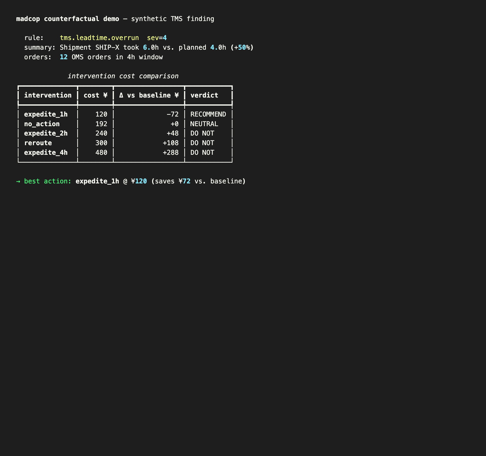
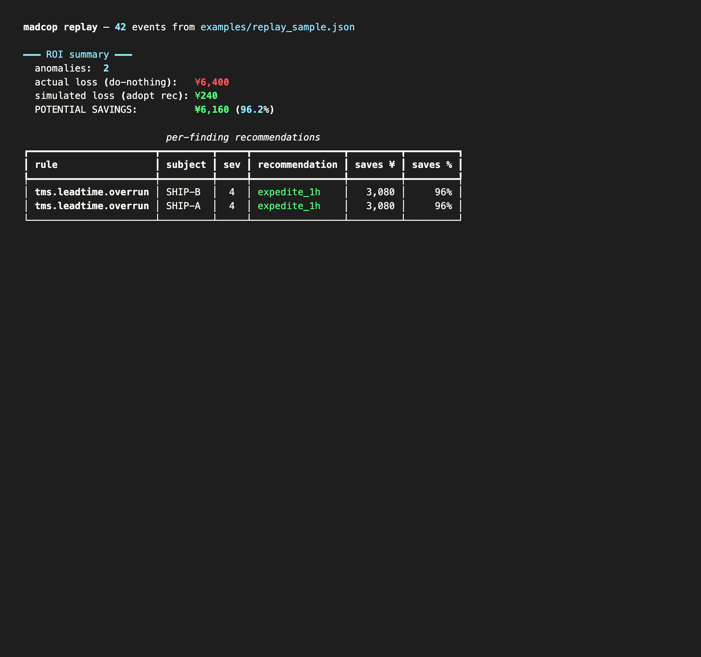
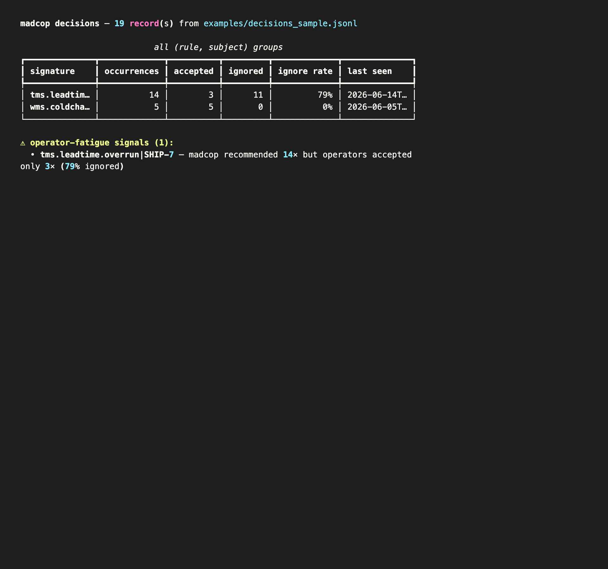
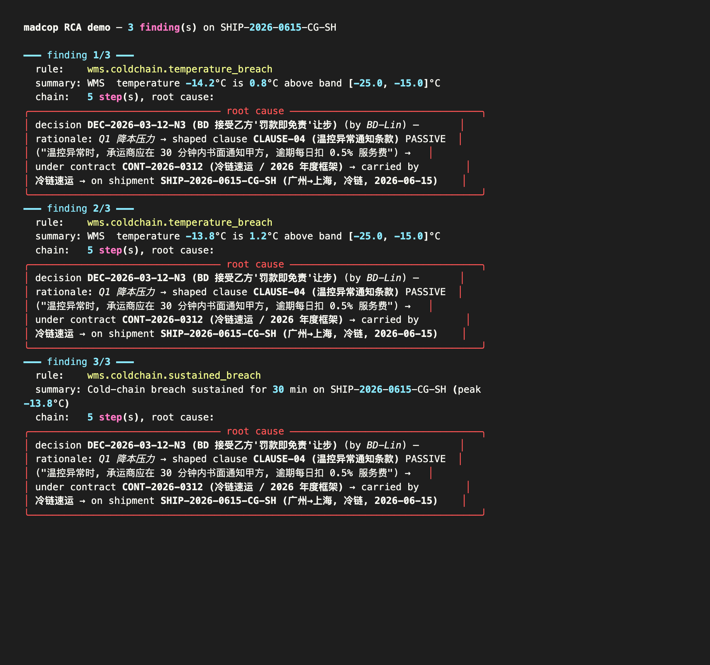
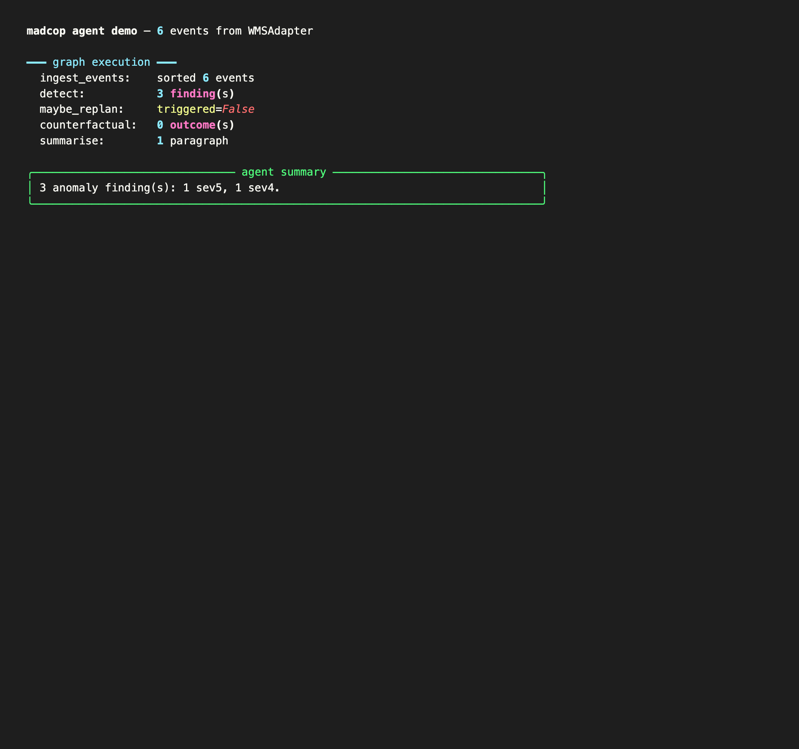

# madcop

> **mad** + **cop** — the supply chain cop that goes *mad* for anomalies.
> Pluggable LangGraph framework: from "detect" to "diagnose" to "decide", with self-evolution.

[](#tests)
[](#requirements)
[](#license)
[](https://pypi.org/project/madcop/)

|  |  |
|--|--|
|  |  |

**madcop** is a pluggable supply chain anomaly framework. It turns raw
telemetry (orders, shipments, warehouse readings, contracts) into
**decision prompts** with full causal chains. Where most tools stop at
"alert fired", madcop walks the chain back to the **human decision**
that made the anomaly possible.

The name is short for **mad cop** — a cop that goes mad for anomalies. Not
in a punitive sense, but in the sense of "won't let a single anomaly go
untraced to its source".

## What's new in v0.6.0

| v0.5.0 | v0.6.0 |
|--------|--------|
| Fixed linear graph (ingest → detect → counterfactual → decision → summarise) | Plan-execute-replan loop with 4 modes (flash / standard / pro / ultra) |
| Single LLM call per session | Multi-model orchestration — auto router picks T1/T2/T3 per step, manual override in `~/.madcop/config.yaml` |
| Single LLM provider (OpenAI-compat) | 5 default providers registered (nvidia_nim, nvidia_glm, zhipu, openai, deepseek) + custom add |
| 2-layer memory (working + episodic) | 4-layer memory — L1 working / L2 episodic / L3 semantic / L4 reflective + cross-layer retriever with time-decay |
| No self-growth | 3-mechanism 成长 engine — episodic→semantic distillation, feedback reflection, meta-pattern mining |
| Ad-hoc eval | EvalRunner v2 — `EvalTrend` (cross-run regression), `RobustnessProbe` (4 input perturbations), `AdversarialChecker` (safety smoke tests) |
| 214 tests | 382 tests |
| No scratchpad / compactor | `Scratchpad` (cross-step state on disk) + `ContextCompactor` (sliding window + summarization) |
| No cost tracking | `CostTracker` (per-call + per-run cost) with token estimation for CJK + ASCII |

### Quick taste

```python
from madcop.agent import PlanExecuteLoop, TrivialPlanner, FnStepExecutor, ExecutionMode
from madcop.strategy import ModelRouter, ProviderRegistry
from madcop.memory import MemoryStore, EpisodicMemory, SemanticMemory, ReflectiveMemory, GrowthEngine

# 1. Plan-execute-replan loop
loop = PlanExecuteLoop(
    planner=TrivialPlanner(),
    executor=my_executor,           # you provide one
    config=PlanExecuteConfig(mode=ExecutionMode.PRO),
)
result = loop.run("diagnose OMS cancel spike")
print(result.final_output)         # multi-step report
print(f"cost: ${result.total_cost_usd:.4f}")

# 2. Multi-model router (auto + manual)
router = ModelRouter(ProviderRegistry.default(), mode="auto")
tier = router.classify(task_signals)  # T1 reasoning / T2 balanced / T3 fast

# 3. 4-layer memory + 3-mechanism growth
store = MemoryStore(path="~/.madcop/memory.db")
epi = EpisodicMemory(store); sem = SemanticMemory(store); ref = ReflectiveMemory(store)
engine = GrowthEngine(epi, sem, ref, my_llm)
facts = engine.distill_episode(my_episode)         # M1
refl  = engine.record_feedback(epi, rating=5)      # M2
metas = engine.mine_meta_patterns()                # M3
```

### Design philosophy (v0.6.0)

Five principles shaped v0.6.0. They're not features — they're decisions
about what kind of software madcop wants to be.

**1. Personal-first, not team-first.** madcop runs on a laptop. One
process, one SQLite file, one operator. No gateway, no Redis, no
Kubernetes. If you need a multi-tenant agent platform, you're looking
for the wrong tool — and that's fine, those exist.

**2. Local-first, no cloud lock-in.** Memory is a SQLite file at
`~/.madcop/memory.db`. Trends are a JSONL file. Eval results are
JSON. You can `cat` everything, `grep` everything, and back up
everything with `rsync`. There is no Langfuse or LangSmith to log
into.

**3. Self-growth over time.** madcop is the only mainstream AI agent
framework (that we know of) where the memory layer is the *primary*
deliverable, not an afterthought. The 3-mechanism 成长 engine means
that the longer you use madcop, the more it knows about your domain,
your preferences, and your meta-strategies. New here, not as a
checkbox.

**4. Cost-aware routing as a first-class concern.** Every step of
every run can pick a different model. The auto router scores each
step on 4 signals (structural / domain / context / user) and picks
T1 (reasoning) / T2 (balanced) / T3 (fast). Manual override per
provider in `~/.madcop/config.yaml`. Built because shipping
"always-call-gpt-4" demos is a lie.

**5. The harness is small enough to read in one sitting.** The whole
plan-execute-replan loop is ~90 lines. The router is ~300 lines. The
memory layer is 6 modules averaging 200 lines each. We picked this
deliberately — every line of indirection is a line you can't debug.

## What's new in v0.7.0

v0.7.0 adds a **sub-agent layer** to the v0.6.0 plan-execute loop. The
lead agent can now dispatch steps to specialised sub-agents that run
in parallel, in isolated contexts, and cannot recursively spawn more
sub-agents.

The pieces:

- `SubagentSpec` — a frozen dataclass describing a sub-agent (name,
  description, system_prompt, tools, disallowed_tools, max_turns,
  timeout). Two ships with v0.7.0: `general-purpose` (multi-step
  reasoning, inherits parent tools) and `bash` (shell command
  execution, tools = `("bash",)`).
- `SubagentResult` + `SubagentStatus` — race-safe state machine with
  `try_set_terminal()`. The first writer of a terminal status wins;
  late writes are no-ops. The four terminal states are `COMPLETED`,
  `FAILED`, `CANCELLED`, `TIMED_OUT`.
- `SubagentExecutor` — runs sub-agents on a `ThreadPoolExecutor`
  capped at 3 (clamped to `[1, 4]`). Each sub-agent gets a deep
  copy of the parent's context (no leakage back). Cancellation is
  cooperative: set `holder.cancel_event`, the runner checks it
  between LLM calls.
- `PlanStep.subagent` — set this on any plan step to dispatch the
  step to a sub-agent instead of running it inline. The lead agent's
  plan-execute loop routes sub-agent steps through the executor;
  inline steps go through the v0.6.0 path.

Three things we deliberately did not do:

- Sub-agents cannot spawn sub-agents. The `task` tool is hard-coded
  as disallowed; this prevents recursive explosions.
- We did not implement custom sub-agents from user config. That's
  v0.7.1.
- We did not build an async executor. The thread pool is enough
  for personal use; if you need asyncio, open an issue.

```python
from madcop.agent import PlanExecuteLoop, PlanStep, Plan, ExecutionMode
from madcop.agent.subagent import SubagentExecutor, FnRunner, ExecutorConfig

# 1. Build a runner — real impl wraps your LLM client; here we use a
#    function for tests + simple integrations.
runner = FnRunner(lambda **kw: f"[{kw['agent'].name}] {kw['prompt']}")

# 2. Build the executor. max_concurrent caps the thread pool.
executor = SubagentExecutor(runner=runner, config=ExecutorConfig(max_concurrent=3))

# 3. Write a plan that mixes inline + sub-agent steps.
plan = Plan(steps=[
    PlanStep(name="ingest", action="gather data"),               # inline
    PlanStep(name="analyse", action="classify findings",         # sub-agent
             subagent="general-purpose"),
    PlanStep(name="report",  action="build CSV",                 # sub-agent
             subagent="bash"),
])

# 4. Run the loop. Sub-agent steps are dispatched in parallel where
#    the plan allows; inline steps run sequentially.
loop = PlanExecuteLoop(my_planner, my_inline_executor)
result = loop.run("diagnose something")
```

Run the demo: `python examples/v070_subagent_demo.py`. It dispatches
two sub-agents in parallel and merges the results into one report.

## What madcop actually does

Five CLI demos, all runnable after `pip install madcop`. The output below
is real — these are the screenshots rendered straight from the CLI.

### 1. Counterfactual cost simulation — "if we'd acted 1h earlier, we save ¥72"



A TMS shipment was 50% late (planned 4h, actual 6h). madcop simulates 5
interventions and recommends `expedite_1h` — **net saving ¥72** vs.
doing nothing. The other options (2h expedite, reroute, 4h expedite)
all cost *more* than they save, even though they "feel safer".

### 2. Anomaly replay — "if every recommendation had been adopted, savings = 96.2%"



Re-running madcop over a historical event log quantifies the total
ROI: actual loss ¥6,400 → simulated loss ¥240 → **¥6,160 saved (96.2%)**.
This is the single number every supply chain manager wants but most
monitoring tools can't produce.

### 3. Decision diff — "operator ignored this recommendation 11 of 14 times"



When madcop keeps recommending the same action but humans keep
rejecting or ignoring it, that's a **fatigue signal**. The same
`(rule, subject)` signature appearing ≥2 times with ≥50% ignore rate
gets flagged. Above: `tms.leadtime.overrun|SHIP-7` recommended 14×
but accepted only 3× (79% ignored).

### 4. Root-cause analysis — anomaly → 5-step chain → contract decision



Every anomaly can be traced back through a typed property graph: from
the temperature reading on a specific shipment, through the supplier, to
the contract clause (PASSIVE — "notify within 30 min or pay 0.5%"), to
the BD decision that accepted the concession three months earlier.

### 5. LangGraph orchestration — detect → replan → counterfactual → diff → summary



The full pipeline as a typed state machine. Each node is a pure
function (no LLM call) so the whole thing runs air-gapped.

## Architecture (4 layers, 1 graph)

```
┌──────────────────────────────────────────────────────────────┐
│  L6  Replay + Decision Diff   — "if we'd listened" ROI,      │
│                                operator-fatigue detection     │
├──────────────────────────────────────────────────────────────┤
│  L5  LangGraph                — 6-node state machine          │
│                                (ingest → detect → replan →    │
│                                 cf → diff → summarise)        │
├──────────────────────────────────────────────────────────────┤
│  L4  Counterfactual + Planning — cost simulation, safety     │
│                                 stock, EOQ, ABC classification│
├──────────────────────────────────────────────────────────────┤
│  L3  CUSUM anomaly engine     — Page 1954 SPC + category     │
│                                 baselines (pharma 0.02,       │
│                                 apparel 0.30, ...)            │
├──────────────────────────────────────────────────────────────┤
│  L2  RCA + Multi-zone WMS     — frozen / refrigerated /      │
│                                 controlled / ambient bands    │
├──────────────────────────────────────────────────────────────┤
│  L1  Unified Data Layer       — OMS/TMS/WMS/BMS adapters,    │
│                                 UTC-validated, severity-rated │
└──────────────────────────────────────────────────────────────┘
```

## What's shipped in v0.4.0

| Layer | Component | Status |
|-------|-----------|--------|
| L1 | `UnifiedEvent` with UTC + severity + source/event_type validation | ✅ |
| L1 | `BaseAdapter` contract + WMS mock (cold-chain, 4 zones) | ✅ |
| L2 | `Detector` + 5 rules (cold-chain temp/duration, OMS CUSUM, TMS lead, BMS score) | ✅ |
| L2 | `KnowledgeGraph` + `trace()` + `explain()` RCA | ✅ |
| L2 | Cold-chain seed graph (5 nodes, 4 edges) | ✅ |
| L3 | CUSUM change-point detector with category-specific baselines | ✅ |
| L4 | Counterfactual cost engine (5 canned interventions, pure functions) | ✅ |
| L4 | Planning primitives: safety_stock / reorder_point / EOQ / ABC | ✅ |
| L5 | LangGraph StateGraph orchestrator (6 nodes, no LLM dependency) | ✅ |
| L6 | Replay engine (historical ROI quantification) | ✅ |
| L6 | Decision diff (operator-fatigue detection) | ✅ |

## Installation

```bash
pip install madcop
```

That's it. Requires Python 3.10+. Optional `langgraph` is bundled as a
hard dependency (used by the L5 orchestrator).

## Quick start

```bash
# L1+L2: see the raw event stream and detect anomalies
python -m madcop run coldchain
python -m madcop run anomalies

# L2: trace each anomaly to a root-cause decision
python -m madcop run rca

# L3+L4: cost-simulate interventions on a TMS anomaly
python -m madcop run counterfactual

# L5: run the full LangGraph agent end-to-end
python -m madcop run agent

# L6: replay historical events and quantify the ROI of adopting every recommendation
python -m madcop replay examples/replay_sample.json

# L6: detect "operator fatigue" from a decision log
python -m madcop decisions examples/decisions_sample.jsonl
```

## Tests

```bash
pip install -e ".[dev]"
pytest
```

**149 tests, all passing** (Python 3.10–3.12, macOS / Linux). CI runs on
every push via GitHub Actions. Coverage:

- L1 contract (UTC validation, event type / source system consistency)
- L2 detector (every rule, windowed-rule state machine, multi-zone bands)
- L2 RCA graph (forward/reverse traversal, empty chain, unknown subject)
- L3 CUSUM (Siegmund ARL₀→h, category baselines, persistent-shift detection)
- L4 counterfactual (TMS vs OMS branches, intervention capping, recommend logic)
- L4 planning (safety stock / ROP / EOQ formulas, ABC Pareto cutoffs)
- L5 LangGraph graph (node wiring, end-to-end with empty / WMS / synthetic events)
- L6 replay (ROI totals, top savings, JSON event loader with case normalisation)
- L6 decision diff (signature aggregation, ignore-rate filtering, JSONL I/O)

## Why "madcop"?

When the user asked for a name for "the agent that goes mad for
anomalies", the obvious answer was **mad + cop**. The product is a cop
that goes mad for anomalies — not in a punitive sense, but in the
sense of "won't let a single anomaly go untraced to its source."

## License

MIT. See [`LICENSE`](LICENSE).

## Contact

Lin Ruihan · chuiniu@me.com