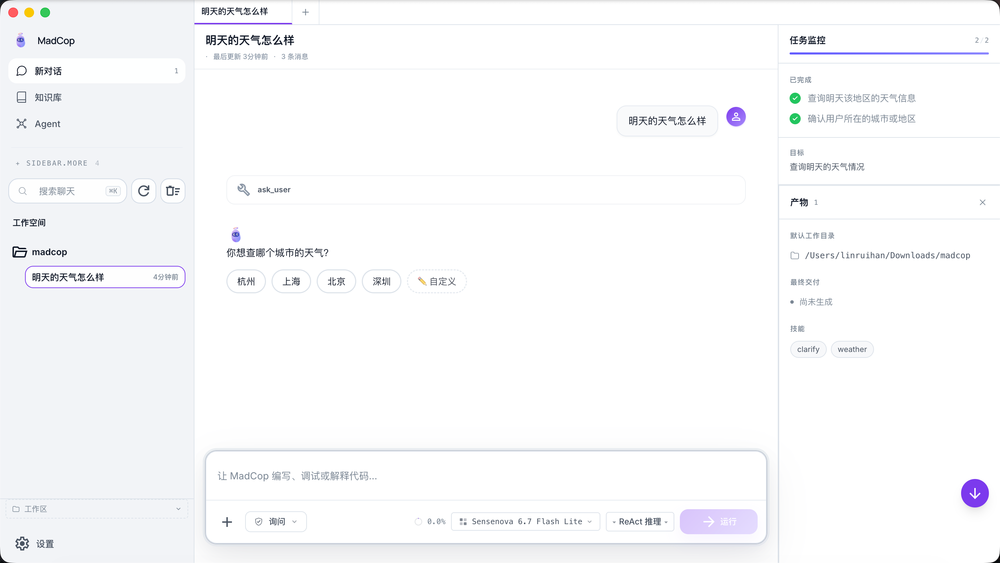
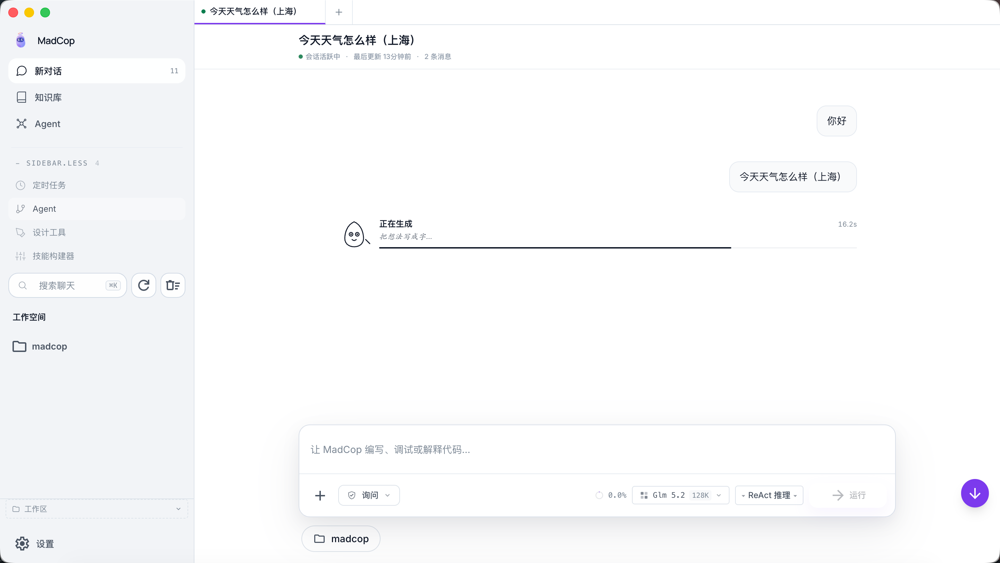
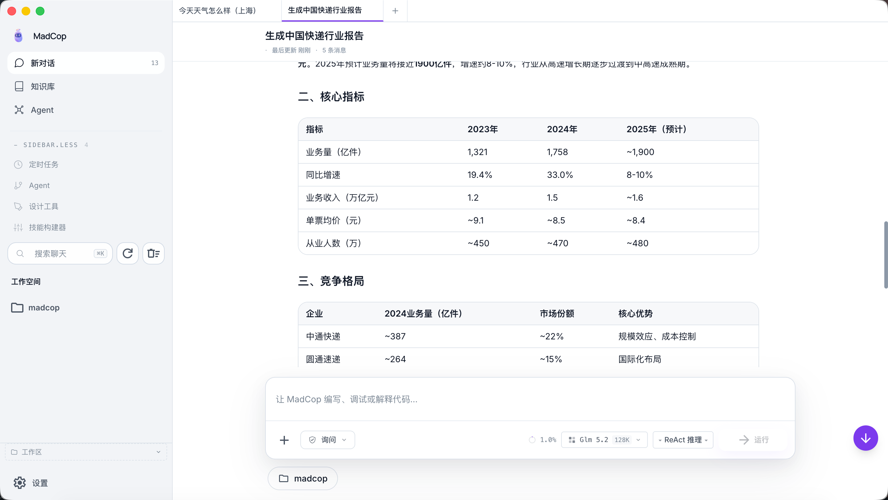

# MadCop

**A local-first AI agent desktop workstation.**

MadCop is a cross-platform desktop application that brings the power of modern LLMs into a private, agentic workflow. It runs as a single Electron binary on macOS, Windows, and Linux, talks to any OpenAI-compatible API endpoint, and keeps your conversations, files, and knowledge base entirely on your machine. No cloud lock-in, no per-seat fees, no data leaving the device.

This document explains the *why* behind the major design decisions — written for product managers and reviewers who want to understand how the system is put together, not just a list of features.

---

## Preview

<table>
  <tr>
    <td align="center"><b>Clarify &amp; choose</b><br/>Interactive question chips · User avatar · Task monitor panel</td>
  </tr>
  <tr>
    <td></td>
  </tr>
  <tr>
    <td align="center"><b>Structured report output</b><br/>Markdown tables · Key takeaways · Assistant avatar</td>
  </tr>
  <tr>
    <td></td>
  </tr>
  <tr>
    <td align="center"><b>Plan-driven execution</b><br/>Step-by-step planning progress · Live task tracking</td>
  </tr>
  <tr>
    <td></td>
  </tr>
</table>

---

## What problem is MadCop solving?

The dominant LLM desktop clients (ChatGPT, Claude.ai, Gemini) are excellent chat surfaces but they assume a specific shape of interaction: one human, one model, one conversation at a time, with vendor-managed tools and memory. That works for "answer this question" but it does not work for "I need to (a) search the web, (b) read a local file, (c) summarise the result, (d) save a Markdown report to disk" — which is a normal afternoon for a product manager, analyst, or engineer.

MadCop is built around three observations:

1. **The work is multi-step.** A single useful task almost always needs several LLM calls with intermediate state. A chat that cannot sequence, branch, persist, or call external tools caps you at "Q&A on a webpage".
2. **The data is local.** A working file directory, a Notion export, a `git` history, screenshots, contracts — the substance of real work sits on the user's disk. A client that can only attach a single file per message (or pays per-token for cloud RAG) punishes the people who already have the answer.
3. **The model is a choice, not a vendor.** A senior engineer might need different models for different tasks — one for refactoring code, another for Chinese-language analysis. A privacy-sensitive user wants a self-hosted endpoint. A startup wants to A/B-test cost. A single-vendor client forces that decision at sign-up and never lets you revisit it.

So the design goal is: a thin local shell that lets the user pick their own model, hand it their own files, and let the system orchestrate the rest. Everything else is in service of that.

---

## How is the system structured?

```
┌─────────────────────────────────────────────────────────┐
│                    Electron Shell                       │
│  ┌────────────────────┐   ┌────────────────────────┐  │
│  │  Vue 3 + Pinia +   │   │   Python Backend       │  │
│  │  Tailwind v4 UI    │   │   (FastAPI + Uvicorn)  │  │
│  │  (Renderer Process)│←→│                         │  │
│  └────────────────────┘   │  ┌──────────────────┐  │  │
│                            │  │  LLM Client       │  │  │
│  ┌────────────────────┐   │  │  (OpenAI Compat)  │  │  │
│  │  Workspace Picker  │   │  └──────────────────┘  │  │
│  │  Sidebar / Tabs    │   │  ┌──────────────────┐  │  │
│  │  Chat / Composer   │   │  │  Tool Registry    │  │  │
│  └────────────────────┘   │  │  + MCP Bridge      │  │  │
│                            │  └──────────────────┘  │  │
│                            │  ┌──────────────────┐  │  │
│                            │  │  Workflow Engine  │  │  │
│                            │  │  + Agent Modes    │  │  │
│                            │  └──────────────────┘  │  │
│                            │  ┌──────────────────┐  │  │
│                            │  │  Memory Pipeline  │  │  │
│                            │  │  (5-tier)         │  │  │
│                            │  └──────────────────┘  │  │
│                            └────────────────────────┘  │
└─────────────────────────────────────────────────────────┘
```

The architecture is intentionally **two processes talking over HTTP** — not one big monolith — for three reasons:

1. **The Python backend can be deployed headless.** The same `madcop.server` module runs without Electron (over plain HTTP/WebSocket) for CI, scripting, or embedding in other tools.
2. **The Vue renderer is portable.** Tauri, Web, or a custom shell can reuse the frontend as-is because it never assumes anything about the backend's runtime.
3. **Process isolation protects the user.** A misbehaving tool call cannot freeze the UI; the renderer survives a hung request and can cancel it.

---

## How does model routing work?

Routing is the single most important design question in any LLM client. MadCop routes on **three axes simultaneously**:

### Axis 1: Per-request model selection

The user configures one or more model providers in the Settings panel. Each provider is a name + base URL + API key + model id (any OpenAI-compatible endpoint). The frontend exposes the active provider as a `useSettingsStore.currentModel` ref; the backend receives a `model` field on every `POST /api/chat` and forwards it to the OpenAI-compatible client.

This means **there is no "default model" hard-coded in the backend**. If you don't configure one, you get a clear error on the first request. The model lives in user data, not in the product.

### Axis 2: Per-session tool registry

Different models from different vendors have wildly different tool-use quality. The backend's tool dispatcher handles this by tuning the system prompt per model family. The backend's tool dispatcher (`madcop/tools/registry.py`) registers the **same** toolset regardless of model, but the system prompt is tuned to nudge the model toward emitting function calls. Specifically, every chat request includes an explicit instruction:

> "When the user asks you to do anything that requires real-time information, you MUST call the `web_search` tool. Do not make up answers. Call the tool directly — do not output the tool's parameter description."

This works around the most common failure mode of self-hosted Chinese-tuned models (outputting the JSON schema as text instead of as a structured `tool_calls` array).

### Axis 3: Intent classification → execution mode

A single chat turn can be either "answer this" (one LLM call) or "search the web, read a file, write a report" (many LLM calls with tool side effects). Rather than exposing a dozen graph presets, MadCop collapses this into one **unified four-way mode selector** that simultaneously picks the workflow *and* the reasoning effort:

| Mode | Label | Workflow | Effort | Typical prompt |
|------|-------|----------|--------|----------------|
| `auto` | 自动 | router decides | derived from task | default — hands off to the classifier |
| `quick` | 快速 | single direct LLM call | low | "什么是闭包", "lambda 语法怎么写" |
| `standard` | 标准 | ReAct loop (Thought → Action → Observation) | medium | "修复 auth.py 的 bug", "加一个 email 字段" |
| `deep` | 深度 | multi-agent DAG (plan → code → review) | high | "重构整个认证模块", "代码审查" |

This replaces the earlier `EffortSelector` (a standalone low/medium/high picker) and a defunct "R Act 推理" button — the two were conflated and users could not tell them apart. The selector lives in the composer bar; the old effort control is demoted to a node-config panel in the topology editor for advanced users.

**Routing (`auto`).** When the user leaves the selector on `auto`, the backend's task router (`madcop/agent_network/task_router.py`) classifies the input with pure keyword analysis, checking in priority order: deep patterns (`重构 / 架构 / 代码审查 / 前端.*后端`) → quick patterns (`什么是 / 语法 / 怎么写`) → standard action verbs (`修复 / 添加 / 实现 / 测试`), with a short-text fast path (<15 chars, no action verb → quick). The `/api/agent/route` endpoint returns the decision plus a human-readable reason ("匹配 2 个复杂任务模式"), so the UI can show *why* a mode was chosen.

**Execution.** The three non-auto modes are real engines, not prompts:

- `quick` → one `client.chat()` call, streamed as text.
- `standard` → `madcop/agent_network/react_engine.py` runs a bounded ReAct loop (default 10 steps) that dispatches tool calls through the shared `ToolRegistry` and streams each Thought / Action / Observation as an SSE event.
- `deep` → `madcop/agent_network/engine.py` builds a multi-agent DAG and walks it with `graphlib` topological sort + parallel waves; each node is an agent (planner → coder → reviewer) whose output feeds the next wave.

All three are mounted inside `/api/chat` behind an `agent_mode` field, and each engine's output is mapped onto the existing `text` / `tool` / `tool_result` / `reasoning` / `done` event vocabulary — so the frontend's SSE parser and the existing `ToolCallBlock` / `ToolResultBlock` / `ThinkingBlock` render the steps with no special-casing.

---

## How are tools registered and dispatched?

The tool system is the surface where "agent" stops being marketing and becomes real. MadCop's design is **a single registry that everything reads from**, with three extension points:

1. **Built-in tools** — registered in `madcop/tools/__init__.py::default_registry()`. These include:
   - `web_search` (DuckDuckGo, no API key needed)
   - `web_fetch` (httpx + BeautifulSoup-style HTML→text)
   - `read_file` / `write_file` / `edit_file` (path-confined to allowlisted dirs)
   - `weather` (wttr.in, no key)
   - `clarify` (returns a structured question back to the user)

2. **MCP servers** — any external Model Context Protocol server can be registered at startup via `madcop/tools/mcp.py`. The bridge translates MCP `tools/call` into internal `Tool.__call__` invocations. This means a user can add a private internal API or a database client without forking MadCop.

3. **User-defined Python tools** — any function decorated with `@tool("name", description="...")` is auto-registered. The decorator captures the signature and produces an OpenAI-compatible JSON schema. This is the path for one-off internal tools.

The dispatcher is stateless: each tool call is `registry.dispatch(tool_call) -> ToolResult`. The function looks up the tool by name, validates the arguments against the schema, calls the function, and wraps the return value in a `ToolResult(is_error=..., content=...)`. The chat loop serializes the result and appends it to the message history before the second LLM call.

The frontend's `ToolCallGroup.vue` component reads these results from the SSE stream and renders them as collapsible cards under the assistant message — so the user sees which tools were called, with what inputs, and what was returned.

---

## How does the workspace integration work?

A core anti-pattern in many LLM clients is that the client doesn't know which directory the user is actually working in, so the model writes files to `os.getcwd()` of whatever process spawned it. In MadCop, this is solved with a `WorkspacePanel` component in the sidebar that:

1. Lists the current workspace directory and lets the user pick a new one via a native folder picker (Electron `dialog.showOpenDialog`).
2. Stores the selected path in `localStorage` as `madcop_workspace_dir` *and* on the backend via `POST /api/workspace/dir`.
3. On every chat request, the frontend reads `madcop_workspace_dir` and prepends a system message: *"Your current working directory is `/Users/.../madcop`. When the user asks you to save files, generate reports, or write code, save them under that directory."*

The backend's `WriteFileTool.__init__` accepts an `allowed_dirs` list and the chat handler passes `[_WORKSPACE_DIR, os.getcwd(), os.path.expanduser('~')]` to it. This means a user who picks `~/Documents/projects/foo` cannot accidentally have the model write into `~/Library/Application Support/madcop/`.

The `DirectoryPicker` component in the composer echoes the same path so the user always sees where files would go.

---

## How does persistence work?

The frontend is responsible for **local-first persistence of the conversation log** via `chatStore._persistSession()`:

- Every `sendMessage` writes the current messages + title of that session to `localStorage["madcop_chat_messages"]`.
- On reload, `getSession()` is called the first time a session id is referenced; if the in-memory state has no messages but `localStorage` does, the messages are hydrated.
- The tab list (`madcop_tabs`) and session metadata (`madcop_sessions`) are persisted the same way.

The reason this matters: the backend's session store uses UUIDs but the frontend's session ids are `session-${Date.now()}` (e.g. `session-1783…`). These are two different id schemes that would break hydration if you tried to map them through the backend. Instead, the frontend owns the conversation history and the backend is treated as stateless from the LLM's perspective. This is a deliberate trade: the backend can be restarted, the database can be wiped, the model can be swapped, and the user never loses their thread.

---

## How does the multi-agent routing actually work in practice?

The unified mode selector (Axis 3 above) is the user-facing surface; behind it are three real execution engines plus an automatic classifier. Concretely:

**Auto routing.** When the user sends with `auto` selected, `task_router.route_task()` scores the input against three keyword sets (`_DEEP_PATTERNS`, `_QUICK_PATTERNS`, `_STANDARD_PATTERNS`) in priority order and returns a `RouteDecision(mode, confidence, reason)`. Deep-pattern hits win even on short text (so "重构 X" is deep, not quick); short text with no action verb falls to quick. The decision is attached to the response so the UI can surface the reasoning.

**Standard mode = a bounded ReAct loop.** `react_engine.ReActEngine.run()` prompts the LLM with the tool catalog and a strict `Thought: / Action: / Action Input:` format, parses the reply with anchored regexes, dispatches the action through `ToolRegistry.dispatch(ToolCall)` (which returns a `ToolResult` with `to_message_content()`), appends the observation, and loops — capped at `max_steps` (default 10), after which it forces a `FINAL_ANSWER`. Tool dispatch reuses the *same* registry the normal chat loop uses, so ReAct gets `read_file` / `write_file` / `web_search` / `ask_user` / etc. for free.

**Deep mode = a multi-agent DAG.** `engine.AgentEngine.run()` is async: it reads the network's nodes + edges, builds an upstream map, runs `graphlib.TopologicalSorter.static_order()`, groups nodes into parallel waves (`_build_waves`), and `await asyncio.gather`s each wave. `input`/`start` nodes pass `user_input` through; `merge`/`output` nodes concatenate their upstream outputs; agent nodes call the LLM with a role-tailored system prompt. The default deep network is plan → code → review.

**Why one selector instead of twelve.** The earlier 12-preset workflow catalog (coordinator / swarm / loop / ...) was real code but nobody could tell which to pick, and it conflicted with a separate effort picker. Collapsing to four modes that each bind a concrete workflow to a concrete effort level removed that ambiguity. The topology editor (`AgentOverview.vue`) still ships four buildable graph shapes — chain, parallel, debate, ensemble — for users who want to hand-author a DAG and run it via `/api/agents/networks/run-adhoc`.

---

## How does the design tool work?

The `DesignPage.vue` is a separate page reachable from the sidebar. It contains:

- A text prompt on the left.
- A live canvas on the right showing the generated UI tree as nested Vue components.
- 11 component types (Button, Input, Card, etc.) plus nested Container.
- Per-page state, undo/redo (10 levels), and a `.madcop` file format for save/load.
- Multi-page projects with a directory tree.
- Export to HTML.

The interesting design decision here is that the canvas is **not** an iframe of a separate renderer. It's a Vue tree generated by an LLM call to `DesignTool` (in `madcop/design/`), which produces a structured `DesignData` JSON that the page then renders as live Vue components. The user can click on any element to select it, drag to move, and tweak properties in an inspector. Because the canvas is "real" Vue and not a screenshot, the elements are interactive — you can type into a generated `Input` and see the value update.

---

## How is quality controlled?

A test suite of **1,340+ tests** (all passing on a clean checkout) covers:

- The memory store, the consolidation / pruning pipeline, the prescreen for sensitive content.
- The statistics engine (CUSUM, z-score anomaly detection, counterfactual cost).
- The design tool's component tree compiler.
- The agent-mode system: task router routing cases, the ReAct parser, the ReAct loop with mocked tools, and the `max_steps` guard (`tests/test_agent_mode.py`).
- The backend's HTTP routes, SSE streaming, and session persistence.

The key test discipline is that **the backend is exercised as a black box** — the tests build a FastAPI app, make real HTTP requests, and assert on the response shape. This means the same tests catch the kind of regression that a unit test of `madcop.brain.store` would miss (e.g. a routing change that breaks the URL pattern).

The frontend has lightweight Vitest coverage; most UI behavior is verified manually because the Vue/Pinia state is straightforward to inspect in the browser devtools and the failure modes are visual.

---

## What is the intended audience?

MadCop is built for **power users who have a clear sense of "I have a task" and want to do it in one window**:

- Product managers writing briefs that pull from internal docs and external research, then save as Markdown to a project folder.
- Engineers who want a chat interface that can also `read_file` a source file, `edit_file` a function, and explain what changed.
- Analysts who need a tool that can pull data from the web, structure it, and save the result to disk in a format a colleague can read.
- Researchers who want a local RAG-style workflow over their own document folder, with the model picked from a dropdown rather than dictated by the vendor.

It is **not** built for:

- Users who want a cloud sync model. There is no cloud sync. (If you want one, file an issue.)
- Users who are not comfortable with a config screen full of model API keys. The trade-off for "any model you want" is "you have to bring your own API key".

---

## What is the deployment story?

The intended install is:

```bash
git clone https://github.com/linmy666/madcop.git
cd madcop
pip install -e .
python -m madcop.server  # terminal 1: backend on :8765
cd desktop
npm install
npx vite build --config vite.vue.config.ts   # terminal 2: build Vue renderer
node ./node_modules/electron/dist/Electron.app/Contents/MacOS/Electron \
  ./electron-dist/main.cjs --no-sandbox
```

For a packaged distribution (DMG / EXE / AppImage), see `desktop/electron-builder` config. The expected distribution is a single ~150MB binary that bundles Python via a tree-shaken `pymalloc` style or via the user's system Python, depending on platform.

The model API key is supplied by the user at first launch via the Settings panel. There is no built-in default, no anonymous telemetry, and no required account. The product is the desktop app, not a service.

---

## What is the future direction?

The roadmap in priority order:

1. **Local inference** — integrate MLX (macOS) and llama.cpp (cross-platform) so a user with a 64GB Mac can run a 70B model entirely offline. This unlocks the "no API key needed" path for privacy-sensitive users.
2. **Visual understanding** — the current API endpoint is text-only; once a multimodal model is wired in, the design tool and the workflow editor both benefit from "show me a screenshot, generate the component that matches it".
3. **Skill marketplace** — a "skill" is a named workflow + tool bundle (e.g. "competitor research", "weekly status report"). The current `/api/skills` endpoint is the local-only seed; the next step is opt-in cloud discovery with a rating system.
4. **Mobile companion** — a thin iOS/Android app that talks to the desktop backend over LAN. The local-first model is a good fit for this; the alternative is "no mobile at all".

Each item is independently shippable. None of them require rewriting what already works.

---

## Recent changes

A condensed log of notable work since this README was first written.
The full per-commit history is in `git log`.

**Security (2026-07-17)**
- `/api/filesystem/file` — added allowlist (home / cwd / /tmp) and explicit blocklist of credential paths (`~/.ssh`, `~/.aws`, `~/.gnupg`, `~/.madcop/settings.json`, `master.key`). Previously any caller could read arbitrary files via this endpoint.
- `/api/settings/providers/fetch-models` — added URL scheme + DNS resolution + private/loopback/link-local IP check, so the api_key can no longer be exfiltrated to an attacker-controlled URL.
- Removed a real name, phone number and employer that had been hardcoded as "sample" data in `pages/MemoryPage.vue`; the page now calls the real `/api/memory/*` endpoints and shows an empty state when no data exists.

**Stability**
- `_SESSIONS` / `_MESSAGES` are now mutated under `_PERSIST_LOCK` in both the SSE handler and `_persist_sessions`, so concurrent requests no longer trigger `RuntimeError: dictionary changed size during iteration`.
- `OpenAICompatClient` is cached per `(provider, key, base_url, model)` with a size cap of 8; HTTP keep-alive connections now survive across requests instead of being torn down every chat turn.
- `UIMessage` type union in `chatStore.ts` aligned with what the code actually emits (the old `type: 'user'` branch was unreachable — every push was `type: 'user_text'`).
- The empty `providerStore.fetchProviders()` is now a real fetch against `/api/settings`; components no longer see a hardcoded 4-item stub.

**Experience**
- Streaming tokens are now coalesced via `requestAnimationFrame` — the per-token markdown re-parse is gone, long replies render smoothly.
- Global keyboard shortcuts: `Cmd/Ctrl+B` (toggle sidebar), `Cmd/Ctrl+N` (new chat), `Esc` (close palette / dispatch global-escape). They do not fire while typing in inputs (Esc is the exception).
- Theme switch in Settings → 通用 → 主题 now actually applies (`onThemeChange` calls `setAppearance(v)`); the previous version only persisted the value to the backend and never updated `data-madcop-theme` on `<html>`.
- SSE chat messages are now persisted by the Vue frontend (was a long-standing bug where the SSE path never wrote to `_MESSAGES`, so sessions lost all history on restart).
- "DESIGN PRINCIPLES" (no emoji, neutral palette + one accent, 8px grid, 4-8px corners, no gradients, system fonts) added to the chat system prompt and injected into every deep-mode agent's prompt.

**UI redesigns**
- `pages/WorkflowsListPage.vue`, `KnowledgeBase.vue`, `AgentOverview.vue`, `DesignPage.vue` rewritten to use semantic class names + scoped CSS instead of inline `style="..."` attributes. Cards have hover states, the workflow list has skeletons and a proper empty state, the agent page has topology preset cards with mini SVG previews.

**Bug fixes found during E2E testing (2026-07-17)**
- "做个登录页面" was incorrectly classified as `general` (no coder/designer) — added common UI keywords ("登录页/注册页/表单/导航栏") to the design category patterns.
- `REACT_SYSTEM_PROMPT.format(...)` raised `KeyError: '"message"'` because the prompt contained `{"message":"..."}` (literal JSON in a rule) — escaped to `{{...}}` so `format()` renders it literally.
- Purple "ask_user" clarification card stayed stuck on screen after the user sent a new message that bypassed it — `sendMessage()` now clears `session.clarificationPending` so a fresh user turn always starts with a clean slate.

---

## Project structure

```
madcop/
├── desktop/                  Electron desktop (Vue 3 + Pinia + Tailwind v4)
│   ├── src/vue/              ~285 .vue files (renderer)
│   ├── public/               Static assets (mascot, icons)
│   ├── electron/             Main process scripts
│   └── theme/                CSS theme system (light / dark / white)
│
├── madcop/                   Python backend
│   ├── server/               FastAPI app, route handlers, SSE streaming
│   ├── llm/                  OpenAI-compatible client + model config
│   ├── tools/                Tool registry, built-in tools, MCP bridge, MCP server
│   │   ├── mac_ax.py         macOS AXAPI bridge (JXA/osascript)
│   │   ├── mac_ax_mcp_server.py  Standalone MCP server wrapping mac_ax
│   │   ├── mcp.py            MCP client (connect to external servers)
│   │   ├── registry.py       Tool ABC, FunctionTool, ToolRegistry
│   │   ├── computer.py       ComputerUseTool (screenshot, click, AXAPI)
│   │   ├── permissions.py    Permission gating for dangerous actions
│   │   ├── files.py          Read/write/edit file tools
│   │   ├── web.py            Web search + fetch tools
│   │   ├── memory.py         Agent-managed long-term memory tools
│   │   ├── cron.py           Cron scheduling tools
│   │   ├── weather.py        Weather lookup tool
│   │   ├── clarify.py        Ask-user-for-clarification tool
│   │   ├── sandbox.py        Bash/shell execution sandbox
│   │   ├── eventbus.py       Event bus + webhook subscriptions
│   │   └── docker_sandbox.py Docker container sandbox
│   ├── workflow/             Plan-and-Execute workflow engine + node types
│   ├── agent_network/        Agent mode system: task router, ReAct engine,
│   │                         multi-agent DAG engine, and the /api/agents API
│   ├── memory/               5-tier memory system (episodic / semantic / reflective / scenario / persona / insight)
│   ├── training/             Continuous learning (local feedback, opt-in)
│   ├── arena/                Multi-LLM comparison endpoint
│   ├── design/               AI design tool backend
│   ├── analysis/             Supply-chain analysis (CUSUM, counterfactual)
│   └── planning/             Heuristic planners (safety stock, EOQ, ABC)
│
├── docs/                     Documentation
│   ├── screenshots/          README product screenshots
│   ├── skills/               Reusable skill definitions (SKILL.md format)
│   ├── img/                  Historical assets
│   ├── design-tool/          Design tool docs
│   └── workflow-editor/      Workflow editor docs
│
├── tests/                    1,340+ pytest tests (backend-focused)
├── start.sh                  One-command startup script
├── README.md
├── LICENSE
└── pyproject.toml
```

---

## Quick Start

```bash
# 1. Clone & build
git clone https://github.com/linmy666/madcop.git
cd madcop
chmod +x start.sh
./start.sh

# Or manually:
# Backend:
pip install -e .
uvicorn madcop.server.app:app --host 127.0.0.1 --port 8765 --reload

# Frontend (separate terminal):
cd desktop
npm install
npx vite build --config vite.vue.config.ts
npm run dev
```

**macOS Computer Use** requires two permissions:
1. **Accessibility** — System Settings → Privacy & Security → Accessibility → add Terminal/Electron
2. **Screen Recording** — System Settings → Privacy & Security → Screen Recording → add Terminal/Electron

---

## macOS Computer Use (mac_ax)

MadCop includes a **pure-JXA** macOS Accessibility API bridge — no pyobjc, no ctypes, no visual model. It's available two ways:

### 1. Built-in tool (via MadCop's agent)
```json
// The agent calls computer_use tool when it needs to interact with the screen
{ "action": "screenshot", ... }
{ "action": "find_element", "label": "搜索", "role": "AXButton" }
{ "action": "click", "x": 400, "y": 300 }
{ "action": "launch_app", "name": "Calculator" }
```

### 2. Standalone MCP Server (for any MCP client)
```bash
# Run the MCP server
python3 -m madcop.tools.mac_ax_mcp_server

# Claude Desktop → Config → MCP Servers → add:
# {
#   "macos-axapi": {
#     "command": "python3",
#     "args": ["-m", "madcop.tools.mac_ax_mcp_server"]
#   }
# }
```

This exposes **10 tools**: `check_permission`, `check_screen_recording`, `list_apps`, `list_windows`, `focus_app`, `launch_app`, `find_element`, `click`, `type_text`, `press_key`.

Any MCP-compatible client (Claude Desktop, Cursor, VS Code, etc.) can connect and use macOS UI automation.

### Architecture
```
┌──────────────┐     MCP/JSON-RPC      ┌─────────────────┐
│  MCP Client  │ ←─── over stdio ───→  │  mac_ax MCP     │
│  (Claude,    │                        │  Server          │
│   Cursor,    │     tools/list         │                  │
│   MadCop...) │     tools/call         │  osascript       │
│              │                        │  → JXA           │
└──────────────┘                        │  → AXAPI         │
                                        └─────────────────┘
```

---

## License

MadCop is licensed under the **GNU Affero General Public License v3.0 (AGPL-3.0)**. The full license text is in [LICENSE](LICENSE).

In short:

- You may use, modify, and distribute MadCop for personal or internal use freely.
- If you run a modified MadCop as a **network service** (e.g. a hosted AI agent workstation for your customers), you **must release the full source code** of your modified version to those users, under the same AGPL-3.0.
- Closed-source SaaS forks are explicitly prohibited by the AGPL. If you want to use MadCop in a commercial product you do not wish to open-source, contact the author for a separate commercial license.

See the additional notice in [LICENSE](LICENSE) for the full text and rationale.


## Author

Lin Ruihan (林芮翰) — Product Manager / engineer.
- GitHub: [@linmy666](https://github.com/linmy666)
- Email: chuiniu@me.com
