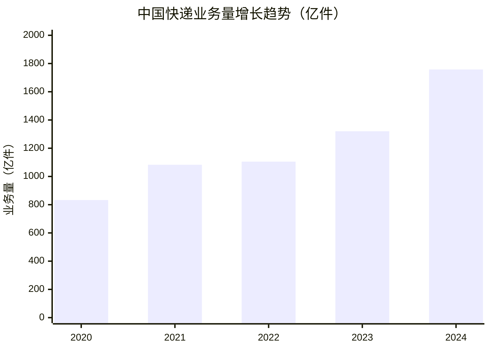
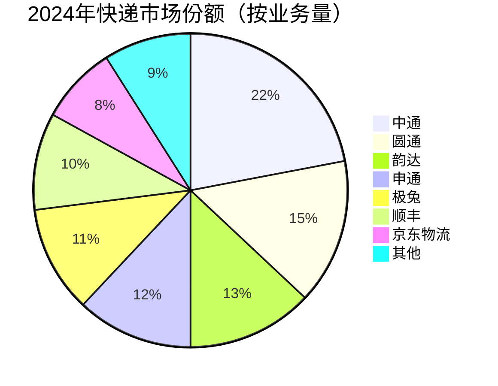

# 中国快递行业BI分析报告（2025）

## 一、市场规模与增长

2024年中国快递业务量达**1758亿件**，同比增长21%，业务收入超**1.4万亿元**。预计2025年突破2000亿件大关。

## 二、市场份额分布

行业CR8超80%，头部效应显著：

## 三、核心企业对比

| 企业 | 份额 | 单票收入 | 核心优势 | 增长策略 |
|------|------|---------|---------|---------|
| 中通 | 22% | ~1.5元 | 规模效应、成本最低 | 下沉+海外 |
| 圆通 | 15% | ~2.4元 | 国际航线布局 | 跨境电商协同 |
| 韵达 | 13% | ~2.1元 | 网络密度高 | 服务质量修复 |
| 申通 | 12% | ~2.0元 | 阿里流量入口 | 产能升级 |
| 极兔 | 11% | ~1.3元 | 东南亚基础 | 新兴市场扩张 |
| 顺丰 | 10% | ~15.6元 | 高端时效件 | 供应链多元化 |
| 京东物流 | 8% | ~10.2元 | 一体化仓配 | 开放化平台 |

## 四、行业演进路径

## 五、关键趋势

- **单票收入企稳**：2024年行业单票均价约2.0元，同比下降幅度收窄至3%以内，价格战基本结束
- **智能化渗透加速**：无人分拣中心超500个，无人配送车在30+城市试点，分拣效率提升30%+
- **绿色化提速**：可循环快递箱投放量超2000万个，新能源物流车占比超40%
- **跨境物流爆发**：Temu/SHEIN带动跨境包裹量同比增长超60%，东南亚为最大增量市场
- **下沉市场深耕**：农村快递网点覆盖率达95%，县乡村三级物流体系基本建成

## 六、风险提示

1. 加盟制网点经营压力仍大，快递员流失率超20%
2. 国际油价波动影响运输成本
3. 数据安全监管趋严，合规成本上升
4. 东南亚本土物流竞争加剧，极兔面临Grab等对手挑战

---

*数据来源：国家邮政局、上市公司财报、行业研究机构 | 报告日期：2025年*
